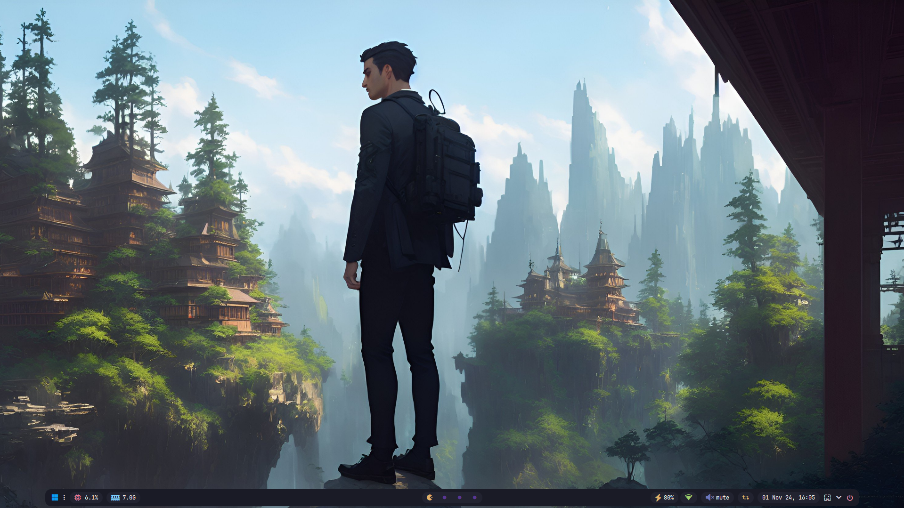
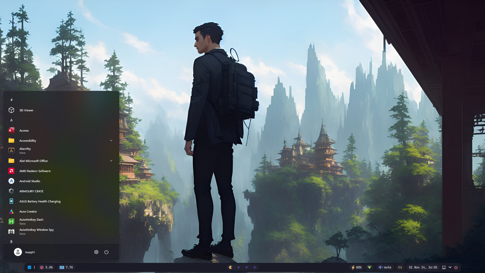

# My Windows Rice Config




## Configurations

- [komorebi](https://github.com/LGUG2Z/komorebi) - Tiling Window Management for Windows.
- [yasb](https://github.com/amnweb/yasb) - A highly configurable Windows status bar written in Python.
- [AutoHotkey](https://github.com/AutoHotkey/AutoHotkey) - free, open source macro-creation and automation software utility that allows users to automate repetitive tasks.
- [taskbarkiller-v3](https://github.com/DiscreteTom/TaskbarKiller-v3) - Press the shortcut key to hide the Windows taskbar.

# 🏯 Solarized Osaka Dark — Unified Theme Pack

A deep, dark theme based on [craftzdog/solarized-osaka.nvim](https://github.com/craftzdog/solarized-osaka.nvim) for Chrome, Zen Browser (Firefox) and DbGate.

Solarized Osaka takes the classic Solarized palette, brightens the foreground for modern monitors, deepens the backgrounds to near-black, and adds extended color ramps for richer UI differentiation.

## Color Hierarchy

All themes share the same surface hierarchy for a cohesive look across apps:

| Layer                    | Hex       | Role                              |
|--------------------------|-----------|-----------------------------------|
| `background`             | `#000c10` | Deepest background, main canvas   |
| `surface`                | `#001419` | Panels, sidebars, inputs, toolbar |
| `surfaceVariant`         | `#00202a` | Elevated/selected states          |
| `surfaceContainerHighest`| `#002c38` | Highest elevation surfaces        |
| `base02`                 | `#063540` | Subtle differentiation layer      |

### Accent Colors

| Color    | Hex       | Usage                        |
|----------|-----------|------------------------------|
| Cyan     | `#29a298` | Primary accent, active state |
| Blue     | `#268bd3` | Links, secondary accent      |
| Green    | `#849900` | Success, strings             |
| Yellow   | `#b28500` | Warning, variables           |
| Red      | `#db302d` | Error, deletion              |
| Orange   | `#c94c16` | Attributes                   |
| Violet   | `#6d71c4` | Purple accent                |
| Magenta  | `#d23681` | Pink accent                  |

---

## Chrome

### File

```
solarized-osaka-chrome.zip
└── solarized-osaka-chrome/
    ├── manifest.json
    └── images/
        ├── theme_frame.png
        ├── theme_frame_inactive.png
        ├── theme_frame_incognito.png
        ├── theme_frame_incognito_inactive.png
        ├── theme_toolbar.png
        ├── theme_tab_background.png
        └── theme_tab_background_incognito.png
```

### Installation

1. Extract `solarized-osaka-chrome.zip` to a permanent location (don't delete it after loading)
2. Open Chrome and navigate to `chrome://extensions`
3. Enable **Developer mode** (toggle in the top-right corner)
4. Click **Load unpacked**
5. Select the `solarized-osaka-chrome` folder (the one containing `manifest.json`)
6. The theme will apply immediately

### Uninstall

Go to `chrome://extensions`, find "Solarized Osaka Dark", and click **Remove**.

---

## Zen Browser

Zen Browser is Firefox-based and uses the `userChrome.css` / `userContent.css` system.

### Files

```
solarized-osaka-zen.zip
└── solarized-osaka-zen/
    ├── userChrome.css    (browser UI: tabs, sidebar, toolbar, menus)
    └── userContent.css   (internal pages: newtab, preferences, addons)
```

### Installation

#### Step 1 — Enable custom CSS

1. Open Zen Browser
2. Type `about:config` in the address bar and press Enter
3. Accept the warning
4. Search for `toolkit.legacyUserProfileCustomizations.stylesheets`
5. Set it to **true** (click the toggle icon)

#### Step 2 — Find your profile folder

1. Type `about:support` in the address bar
2. In the **Application Basics** section, find **Profile Folder**
3. Click **Open Folder** (or **Open Directory** on Linux)

> **Flatpak users:** the profile folder is at `~/.var/app/app.zen_browser.zen/.zen/<profile>/`

#### Step 3 — Copy the theme files

1. Inside your profile folder, create a folder named `chrome` (if it doesn't exist)
2. Extract `solarized-osaka-zen.zip`
3. Copy `userChrome.css` and `userContent.css` into the `chrome` folder

Your folder structure should look like:

```
<profile-folder>/
└── chrome/
    ├── userChrome.css
    └── userContent.css
```

#### Step 4 — Restart Zen Browser

Fully close and reopen Zen Browser (not just a new tab — quit the application entirely).

### Troubleshooting

**Theme not applying at all:**

- Double-check `about:config` → `toolkit.legacyUserProfileCustomizations.stylesheets` is **true**
- Verify the files are named exactly `userChrome.css` and `userContent.css` (case-sensitive on Linux)
- Make sure the `chrome` folder is directly inside your profile folder, not nested

**Zen's transparency/blur overrides the theme:**

The theme already includes rules to disable Zen's transparency. If it still shows through:

1. Open `about:config`
2. Set `widget.windows.mica` to **false** (Windows only)
3. Try changing the Zen sidebar color: **Settings → Theme & Colors** → set sidebar color to `#001419`

**Sidebar color still uses Zen's default:**

Zen applies its own theme color to the sidebar. To override:

1. Go to **Settings → Theme & Colors**
2. Pick a dark color close to `#001419` from the color picker
3. This sets the "base" that CSS then overrides

**Live editing (for tweaking):**

1. In `about:config`, set `devtools.debugger.remote-enabled` to **true**
2. Press `Ctrl+Shift+Alt+I` to open Browser Toolbox
3. Go to the **Style Editor** tab
4. Search for `userChrome` — you can edit live and save with `Ctrl+S`

### Uninstall

Delete `userChrome.css` and `userContent.css` from the `chrome` folder and restart Zen Browser.

---

## DbGate

### File

```
Solarized-osaka_theme.json
```

### Installation

1. Open DbGate
2. Go to **Settings** (gear icon)
3. Navigate to **Theme**
4. Click **Import theme** (or drag-and-drop the JSON file)
5. Select `Solarized-osaka_theme.json`
6. The theme applies immediately

### Alternative (manual)

1. Find your DbGate config directory:
   - Linux: `~/.dbgate/files/`
   - macOS: `~/Library/Application Support/dbgate/`
   - Windows: `%APPDATA%/dbgate/`
2. Copy `Solarized-osaka_theme.json` into the `themes/` subfolder (create it if needed)
3. Restart DbGate
4. Select "Solarized-osaka" from **Settings → Theme**

### Uninstall

Switch to a different theme in **Settings → Theme**, then optionally delete the JSON file.

---

## Credits

- Color palette: [craftzdog/solarized-osaka.nvim](https://github.com/craftzdog/solarized-osaka.nvim)
- Original Solarized: [Ethan Schoonover](https://ethanschoonover.com/solarized/)
